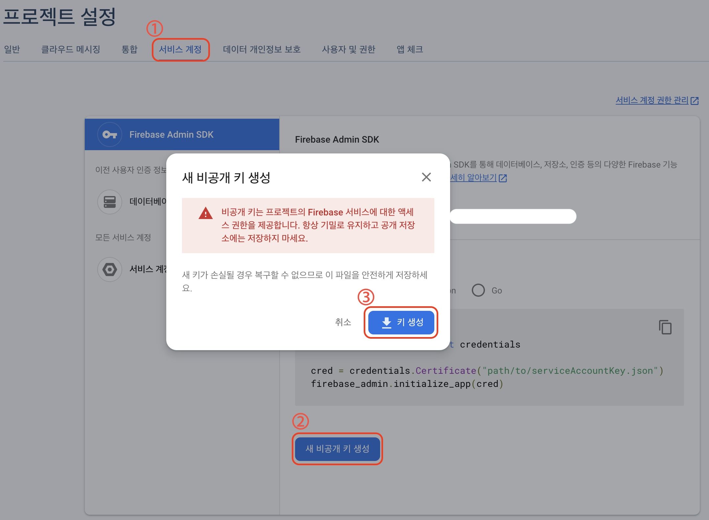
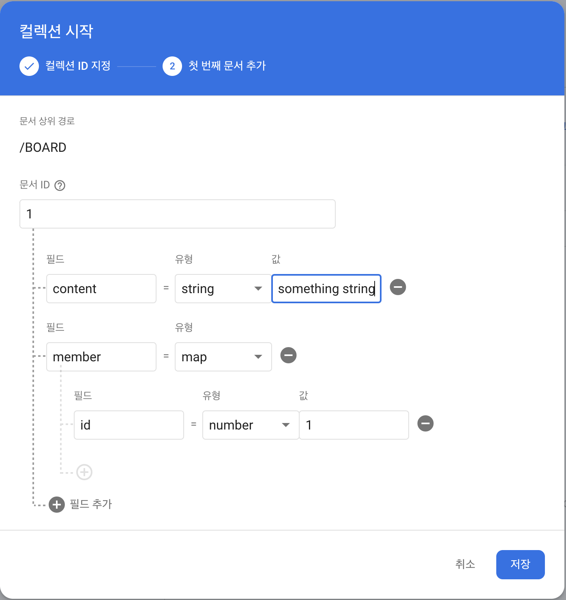
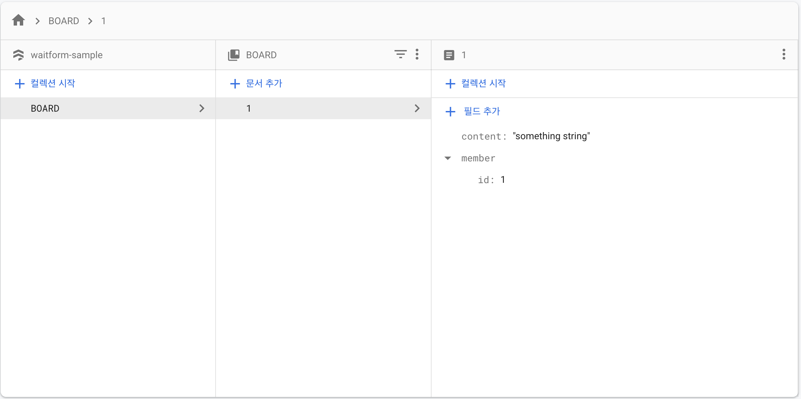
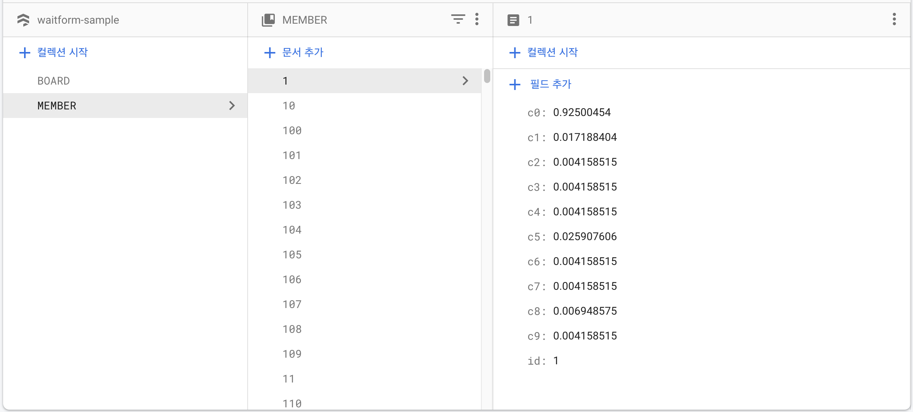
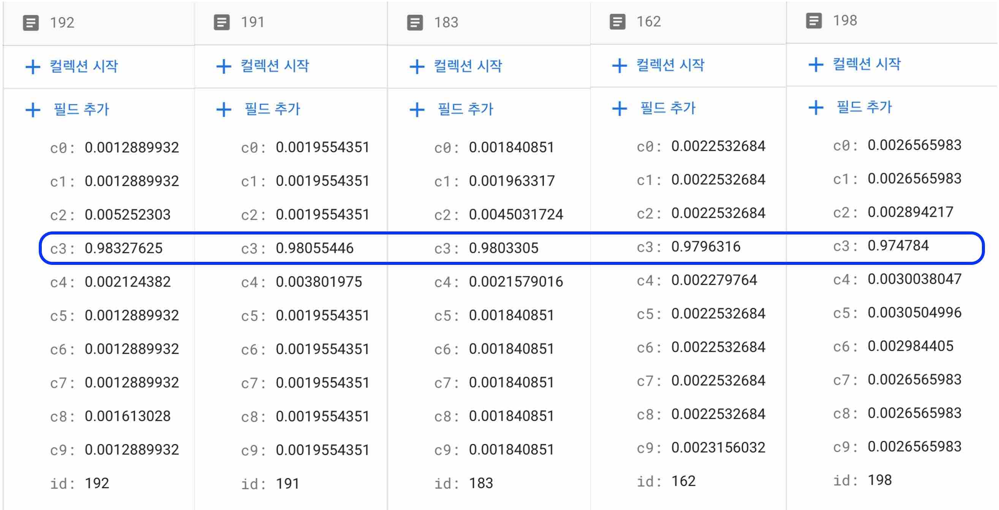

# Firebase settings and builds guide
파이어베이스 설정과 함께 메소드 사용법을 안내합니다.

## Directory Info
```bash
waitform-pipe
├── Firebase    # 파이어베이스 연동과 클러스터링 폴더
│   ├── data    # this directory is not include on github
│   │   ├── bert_classifi_model.pt  # pytorch model
│   │   └── serviceAccountKey.json  # firebase admin sdk
│   ├── BertClassification.py   # pytorch bert classification
│   ├── Cluster.py          # firebase and clustering
│   ├── requirements.txt    # requirements.txt
│   └── README.md           # crawling guide
:   :
├── Models      # 이 문서에서 사용되는 파일이 있기 때문에 포함됩니다
    └── data    # this directory is not include on github
        └── coda_data.csv   # 링크드인 크롤링 데이터입니다.
```

## Firebase 설정
1. [Firebase 사이트](https://firebase.google.com/)에 접속하여 콘솔로 이동합니다.
2. 새 프로젝트 생성합니다. 프로젝트 명은 앞으로 사용할 예정이므로 메모장에 적어두세요
3. ⚙️ 기호(설정)을 눌러 프로젝트 설정으로 이동합니다.
4. 프로젝트 설정에서 서비스계정 > Firebase Admin SDK > Admin SDK 구성 스페닛 > Python > 새 비공개키 생성 합니다.
     
5. 다운받은 json 파일의 이름을 `serviceAccountKey.json`로 바꿉니다.
6. 위의 경로 가이드와 같은 장소로 파일을 옮깁니다.
7. Realtime Database와 Firestore Database를 테스트모드로 활성화합니다.
8. Firestore Database의 규칙이 다음과 비슷하게 구성되어야 합니다.  
   ```bash
   rules_version = '2';
   service cloud.firestore {
    match /databases/{database}/documents {
        match /{document=**} {
            allow read, write: if
                request.time < timestamp.date(2022, 7, 29); # 프로젝트 생성 시점마다 다릅니다.
        }
    }
   }
   ```  
9. 다음과 같은 방식으로 임의의 데이터를 구성합니다.
      
    


## Model
편의를 위해서 파일을 제공합니다. [여기](https://drive.google.com/file/d/1c9kN3U2gk30iOyexRr__B7MEV9hSttQ2/view?usp=sharing)에서 압축 파일(1.04GB)을 다운 받으세요.  
다운 받은 파일을 압축 해제한 후(1.3GB) 위의 경로 가이드와 같은 장소로 파일을 옮기세요.  

만약 모델을 처음부터 구성하려면 상위 폴더의 [Models]()를 참고하세요.  
추가적으로, 아래 작업 중에서 크롤링 데이터셋을 사용합니다. [여기](https://drive.google.com/file/d/1znx3eplfHFf8UcUX5Z-E9eDIG3cQzxQI/view?usp=sharing)에서 압축 파일을 받아 압축해제 후 `Model/data/` 폴더 아래에 넣습니다.

## Requirements
이 모듈에서 사용하는 라이브러리를 설치하려면 다음 명령어를 실행하거나 리스트를 참고하세요.
```bash
pip install -r Firebase/requirements.txt
```
- numpy==1.22.4
- pandas==1.4.2
- pytorch==1.11.0
- scikit-learn==1.0.2
- transformers==4.19.2

이후 [Firebase Documentation](https://firebase.google.com/docs/firestore/quickstart#python)에 따라 `firebase-admin`을 설치합니다.
```bash
pip install --upgrade firebase-admin
```

## Guide
가이드를 따르기 전에 우선 파일을 실행해보려면 아래 명령어를 사용하세요.
```bash
python Firebase/run.py
```  

1. 먼저 firebase와 연결되는지 확인해봅니다.
   ```python
   from Cluster import Cluster       # Cluster 클래스를 사용할 예정입니다
   board_idx = '1'                   # 임의로 만든 데이터를 가져오는 테스트를 해볼 것입니다
   pj_name = 'waitform-sample'       # 아까 메모장에 적어둔 파이어베이스 프로젝트 이름을 넣습니다
   cus = Cluster(board_idx)          # Cluster 클래스를 생성합니다
   cus.connect(pj_name)              # firebase 연결을 시도합니다
   sen, member_idx = cus.getboard()  # 게시물 값과 게시물을 쓴 이용자의 pk값을 가져옵니다
   print("content:", sen, type(sen))    # content: something string <class 'str'>
   print("member_idx:", member_idx, type(member_idx))   # member_idx: 1 <class 'int'>
   ```   
2. 정상적으로 연동이 되었다면 학습된 모델을 불러오고 결과를 뽑습니다.
   본 작업을 수행하기 전에 먼저 임의로 저장했던 데이터를 수정합니다. 이 데이터는 [APEX Systems](https://www.apexsystems.com/job/1265196_usa/sql-database-administrator?catalogcode=USA&address=&radius=50&page=43&rows=25&query=%2A&remote=)의 데이터베이스 전문가 채용 공고문 중 일부입니다. 이 데이터를 `board` > `1` > `content`에 넣습니다.
   - Before
   ```
   something string
   ```
   - After
   ```
   Our client is seeking a SQL Server Database Administrator. The SQL DBA performs advanced implementation/support for systems application and monitoring; is responsible for installing, configuring, and maintaining operating system workstations and servers, including web servers in support of business processing requirements; performs software installations and upgrades to operating systems and layered software packages; schedules installations and upgrades and maintains them in accordance with established IT policies and procedures; monitors and tunes the system to achieve optimum performance; develops and promotes standard operating procedures; conducts routine hardware and software audits of server to ensure compliance with established standards policies and configuration guidelines; develops and maintains comprehensive operating system hardware and software configuration database/library of all supporting documentation; provides integrated team support and maintenance of Technical Services hardware and software; provides design and implementation support for server hardware Microsoft Windows operating systems virtualization Active Directory Group Policy TCP/IP/DHCP/DNS IIS SQL Exchange, Clustering, Load Balancing, SAN/NAS and advanced support.

   The preferred candidate will have:
   Experience installing/upgrading SQL versions, applying SQL patches, backup/recovery, and migration of data.
   Experience and skills related to Windows Server (Windows Server 2012 R2, Windows Server 2016, Windows Server 2019) administration
   Experience with the SSRS, SSAS, SSIS, T-SQL, and SQL Server Powershell.
   Ability to set up and maintain statistics, indexes, and agent jobs.
   Advanced understanding of SQL Security including hardening and addressing SQL Server health assessment reports.
   Provide Technical support for MSSQL databases including responding to help desk tickets and working with customers to resolve issues.

   Minimum Requirements
   Bachelor's Degree in Computer Science or a related field required. Relevant experience may be considered in lieu of a degree
   3 years of relevant experience with Microsoft SQL Server and Microsoft Windows Server (versions 2012/2016/2017/2019 for both).
   Must be available to be on-site in Charlottesville, Virginia. Relocation reimbursement may be provided for the right candidate.
   ```  
   그런 다음 아래 스크립트를 실행합니다.
   ```python
   # 본 작업을 수행하기 전에 BOARD/1/content의 값을 바꿨는지 꼭 확인하세요.
   from BertClassification import BertClassification
   b_class = BertClassification()  # 학습된 모델 불러오기
   b_class.loader()                # 모델 준비
   sample = b_class.evaluate(sen)  # 모델 결과 뽑기
   print("모델 학습 결과:", sample)
   # 모델 학습 결과: [0.00345398 0.00345398 0.01032064 0.9612105 0.00398431 0.00345398 0.00376071 0.00345398 0.00345398 0.00345398]
   ```  
   결과를 알아보기 이전에 사전에 설정했던 인덱스 정보를 확인해봅시다.
   ```python
   labels = {  # 인덱스 설정
    'backend%20developer': 0,
    'software': 1,
    'system': 2,
    'database': 3,
    'network': 4,
    'Frontend%20Developer': 5,
    'Application': 6,
    'Service': 7,
    'Game%20Developer': 8,
    'AI%20Engineer': 9
   }
   ```  
   앞서 구한 결과값 중 가장 높은 값은 4번째였습니다. 위의 인덱스 정보에서 알 수 있듯 4번째 인덱스는 `database`이며 우리가 사전에 넣은 데이터를 잘 분류했음을 알 수 있습니다. 이제 이 결과를 이용해서 클러스터링을 시도하겠습니다.
3. 먼저 클러스터링을 하기 전에 가짜 사용자를 만들겠습니다.
   이 작업은 기존의 데이터셋으로부터 학습되기 때문에 오래 걸립니다(1h+).
   ```python
   import os
   model_path = os.getcwd() + "/Firebase/data/bert_classifi_model.pt"
   data_path = os.getcwd() + "/Models/data/code_data.csv"
   csv_name = os.getcwd() + "/Firebase/data/conv.csv"
   cus.csvdbmaker(model_path, data_path, csv_name)
   cus.checker(csv_name)
   ```
   아래와 같이 성공했음을 볼 수 있습니다.
     
4. 이제 클러스터링을 해보도록 하겠습니다.
   ```python
   # 2번에서 수행한 결과에 이어서 진행됩니다
   merged_sample = np.append(sample, np.array([member_idx]))    # 넘파이 배열에 memeber_idx를 추가
   cus.getmembers(merged_sample)   # 클러스터링을 위한 모든 데이터 가져오기(클래스 내부적으로 저장됨)
   
   members = cus.sortby(sample, 5)    # 클러스터링 새 버전, 상위 5개 추출
   print("클러스터링 결과:", members)     # 클러스터링 결과: [192 191 183 162 198]
   ```
5. 잘 골라냈는지 값을 파이어베이스에서 찾아보겠습니다.
   
   성공적입니다! 위 결과는 사용자마다 다를 수 있지만, 대체적으로 좋은 결과를 얻을 것입니다.
6. 위의 전체 코드는 다음과 같습니다.
   ```python
   from Cluster import Cluster  # 클러스터링 모듈 불러오기
   from BertClassification import BertClassification    # 학습 및 연동 모듈 불러오기
   import numpy as np
   import os
   
   def main():
    # TODO: 아래에서 API에서 받아오는 함수 필요!
    board_idx = '1'             # API로부터 얻었던 board pk 값
    pj_name = 'waitform-sample' # 파이어베이스 프로젝트 이름
    cus = Cluster(board_idx)    # 필요 데이터 넣기
    cus.connect(pj_name)        # firebase 연결
    sen, member_idx = cus.getboard()    # 게시물 값 가져오기
    
    model_path = os.getcwd() + "/Firebase/data/bert_classifi_model.pt"
    data_path = os.getcwd() + "/Models/data/code_data.csv"
    csv_name = os.getcwd() + "/Firebase/data/conv.csv"
    cus.csvdbmaker(model_path, data_path, csv_name)
    cus.checker(csv_name)

    b_class = BertClassification()  # 학습된 모델 불러오기
    b_class.loader()                # 모델 준비
    sample = b_class.evaluate(sen)  # 모델 결과 뽑기

    merged_sample = np.append(sample, np.array([member_idx]))
    cus.getmembers(merged_sample)   # 클러스터링을 위한 모든 데이터 가져오기(클래스 내부적으로 저장됨)

    # TODO: 아래에서 API를 호출해서 보내주는 작업 필요!
    members = cus.sortby(sample, 5)    # 클러스터링 새 버전, 상위 n개 추출

    print("클러스터링 결과:", members)     # 클러스터링 결과: [192 191 183 162 198]
    
    if __name__ == '__main__':
        main()

   ```  
   이 코드는 `run.py` 파일에서도 확인 할 수 있습니다.

## Function Guide
앞서 사용한 함수들과 직접적으로 사용하진 않았지만 내부에 정의되었던 함수들에 대한 정보입니다.
### BertClassification
- `__init__()`
  클래스 생성자입니다.  
  - *parameters*  
    필요한 파라미터가 없는 함수입니다.  
  - *output*  
    반환값이 없습니다.  
  ```python
  b_class = BertClassification()
  ```
- `loader()`
  pytorch 체크포인트로부터 데이터를 불러오는 작업을 수행합니다.  
  - *parameters*  
    필요한 파라미터가 없는 함수입니다.  
  - *output*  
    반환값이 없습니다.  
  ```python
  b_class.loader()
  ```
- `evaluate(sentence)`
  문장을 분류하는 작업을 수행하는 함수입니다.  
  - *parameters*  
    sentence: *필수로 입력해야하는 변수, type=str*  
  - *output*  
    type=list, size=10  
  ```python
  b_class.evaluate(sen)
  ```

### Cluster
- `__init__(board_idx)`  
  클래스 생성자입니다.  
  - *parameters*  
    board_idx: *필수로 입력해야하는 변수, type=str*   
  - *output*   
    반환값이 없습니다.  
  ```python
  board_idx = '1'
  cus = Cluster(board_idx)
  ```
- `connect(pj_name)`
  파이어베이스 연동하는 함수입니다.  
  - *parameters*   
    pj_name: *필수로 입력해야하는 변수, type=str*  
  - *output*  
    반환값이 없습니다.  
  ```python
  pj_name = 'waitform-sample'
  cus.connect(pj_name)
  ```  
- `getboard()`  
  파이어베이스에서 게시물 데이터를 가져오는 함수입니다.  
  - *parameters*   
    필요한 파라미터가 없는 함수입니다.  
  - *output*  
    type: (type=str, type=str), type=tuple   
    만약 데이터를 찾지 못하거나 다른 오류라면 (None, None)이 반환됩니다.  
  ```python
  sen, member_idx = cus.getboard()
  ```  
- `getmembers(class_arr)`  
  파이어베이스에서 모든 사용자 데이터를 가져오는 함수입니다.
  - *parameters*   
    class_arr: *필수로 입력해야하는 변수, type=np.array, size=11*
  - *output*  
    type: (type=str, type=str), type=tuple   
    만약 데이터를 찾지 못하거나 다른 오류라면 "no connection!"이 반환됩니다.  
  ```python
  import numpy as np
  merged_sample = np.array([0.1, 0.1, 0.1, 0.1, 0.1, 0.1, 0.1, 0.1, 0.1, 0.1, 1])
  cus.getmembers(merged_sample)
  ```  
- `creator(n=1000)`: **deprecated function**  
  파이어베이스에 가짜 사용자를 만들어내는 함수입니다.  
  - *parameters*   
    n: *기본값 1000, type=int*
  - *output*  
    반환값이 없습니다.  
  ```python
  cus.creator(n=500)
  ```  
- `creatorbycsv(df)`  
  데이터프레임으로부터 가짜 사용자를 파이어베이스에 저장 함수입니다.  
  - *parameters*   
    df: *필수로 입력해야하는 변수, type=dataframe*
  - *output*  
    반환값이 없습니다.  
   ```python
   import pandas as pd
   column = ['c0', 'c1', 'c2', 'c3', 'c4', 'c5', 'c6', 'c7', 'c8', 'c9', 'id']
   df = pd.DataFrame(columns=column)
   cus.creatorbycsv(df=df)
   ```  
- `checker(csv_name="conv.csv")`  
  csv 파일로부터 가짜 사용자를 만들어내는 함수입니다.  
  - *parameters*   
    csv_name: *기본값 conv.csv, type=str*
  - *output*  
    반환값이 없습니다.  
   ```python
   csv_name = "[your_csv_name.csv]"
   cus.checker(csv_name)
   ```
- `clear(n=1000)`  
  파이어베이스의 사용자의 모든 데이터를 삭제하는 함수입니다.  
  - *parameters*   
    n: *기본값 1000, type=int*  
  - *output*  
    반환값이 없습니다.  
   ```python
   cus.clear(n=500)
   ```
- `cluster(k=10, max_return=5)`: **deprecated**  
  모든 사용자를 k개 집합으로 클러스터링하는 함수입니다.  
  - *parameters*   
    k: *기본값 10, type=int*  
    max_return: *기본값 5, type=int*  
  - *output*  
    type=list, length=max_return
   ```python
   cus.cluster(k=10, max_return=10)
   ```  
- `sortby(m_result, n)`  
  모델로 얻을 결과를 기반으로 가장 유사한 상위 n개 유저 id를 출력하는 함수입니다.
  - *parameters*   
    m_result: *필수로 입력해야하는 변수, type=np.array, size=10*  
    n: *필수로 입력해야하는 변수, type=int*  
  - *output*  
    type=list, length=n
   ```python
   m_result = np.array([0.00345398, 0.00345398, 0.01032064, 0.9612105, 0.00398431, 0.00345398, 0.00376071, 0.00345398, 0.00345398, 0.00345398])
   cus.sortby(m_result=m_result, n=5)
   ```  
- `update(member_idx, class_arr)`  
  사용자 1명의 데이터를 갱신하는 함수입니다.
  - *parameters*   
    member_idx: *필수로 입력해야하는 변수, type=str*  
    class_arr: *필수로 입력해야하는 변수, type=np.array, size=10*  
  - *output*  
    실패시 Failed: member data update를 반환합니다. 성공시에는 아무런 response가 없습니다.  
   ```python
   member_idx = '1'
   class_arr = np.array([0.00345398, 0.00345398, 0.01032064, 0.9612105, 0.00398431, 0.00345398, 0.00376071, 0.00345398, 0.00345398, 0.00345398])
   cus.update(member_idx=member_idx, class_arr=class_arr)
   ```  
- `csvdbmaker(model_path, data_path, csv_name="conv.csv")`  
  가짜 사용자를 만들어 csv 파일로 저장하는 함수입니다.
  - *parameters*   
    model_path: *필수로 입력해야하는 변수, type=str, 파이토치 모델 경로가 입력되어야 합니다*  
    data_path: *필수로 입력해야하는 변수, type=str, 데이터셋 경로가 입력되어야 합니다*  
    csv_name: *기본값 conv.csv, type=str*
  - *output*  
    반환값이 없습니다.  
   ```python
   import os
   model_path = os.getcwd() + "/Firebase/data/bert_classifi_model.pt"
   data_path = os.getcwd() + "/Models/data/code_data.csv"
   csv_name = os.getcwd() + "/Firebase/data/conv.csv"
   cus.csvdbmaker(model_path=model_path, data_path=data_path, csv_name=csv_name)
   ```  