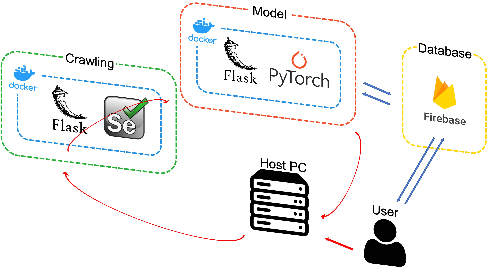

# waitform-pipe
이 레포는 [ALGO-LEARN/waitForm](https://github.com/ALGO-LEARN/waitForm)에서 담당 파트를 Pipe-line 적용한 레포입니다.  
전체 프로세스에 대한 정보는 위의 링크를 참고하세요.  

## Quick Start
_Note: silicon mac의 경우 cuda를 사용할 수 없으므로 dockerfile의 FROM을 `pytorch`에서 `python:3.8`으로 수정하세요_
- 이미지를 생성합니다
  ```bash
  docker build -t waitform-pipe .
  ```
- 컨테이너를 생성 및 실행합니다
  ```bash
  docker run -p 8080:80 --name waitfrom waitform-pipe
  ```

## Directory Info
```bash
waitform-pipe
├── Crwaling                # crawling folder
│   ├── data                # data folder
│   │   ├── data.zip        # post data
│   │   └── link.zip        # link data
│   ├── ChromeDriver.py     # chromedriver handler
│   ├── crawling_incruit.py # site::incruit crawling code
│   ├── crawling_wanted.py  # site::wanted crawling code
│   ├── crawling_linkedin.py    # site::linkedin crawling code    ⎫
│   ├── crawling_programmers.py # site::programmers crawling code ⎬ support by @tpqls0327
│   ├── crawling_saramin.py     # site::saramin crawling code     ⎭
│   ├── CSVhandler.py       # csv file handler
│   ├── run.py              # start file
│   ├── requirements.txt    # requirements.txt
│   └── README.md           # crawling guide
│
├── Models                  # deep-learning model folder
│   ├── BertTextClassification.py   # pytorch bert classification model
│   └── functions.py        # training, evaluate, test functions
│
├── Firebase        # linking Cloud Firestore & model clustering folder
│   ├── Cluster.py  # init firebase and clustering code
│   ├── BertClassification.py   # reasoning model code
│   ├── requirements.txt    # requirements.txt
│   └── README.md   # firebase the guide
│
├── images          # readme images
│   ├── *.jpeg      # jpg images
│   └── *.png       # png images
│
├── .gitignore      # gitignore
└── README.md       # readme
```

- 데이터 수집에 관한 내용은 [Crawling](./Crawling/) 폴더를,
- 모델 학습에 관한 내용은 [Models](./Models/) 폴더를,
- 데이터베이스와 연동하여 추론하는 과정은 [Firebase](./Firebase/) 폴더를,
- 앞의 과정을 파이프라인화 하는 RestAPI는 `API` 폴더를 _이 폴더는 아직 미완성입니다_  
참고해주세요

## Prerequisites
- python 3.8 or conda prompt
- Docker
- 각 모듈별 필요 라이브러리는 각 폴더에 있는 `requirements.txt`를 참고해주세요.

## Environment Setting
`pip list --format=freeze > requirements.txt`  
아래 중 익숙한 방식으로 환경으로 구성하세요.  
1. Conda
- `requirements.yaml` 파일로 가상환경과 라이브러리를 함께 설치합니다.
  ```bash
  conda env create -f requirements.yaml
  ```
- 아래의 명령어로 만들어진 가상환경을 실행시킵니다.
  ```bash
  conda activate wait
  ```

2. pip
- `venv`를 이용해 새 가상환경을 만듭니다.
  ```bash
  python -m venv wait
  ```
- 만들어진 가상환경에 접속합니다.
  ```bash
  cd wait
  activate.bat
  ```
- `requirements.txt` 파일로 필요 라이브러리를 설치합니다.
  ```bash
  pip install -r requirements.txt
  ```

## Pipe-line
데이터 수집과정과 학습과정을 파이프라인으로 만들었습니다.


이 과정을 수행하려면 아래 명령어를 따르세요.
```bash
# please wait
```